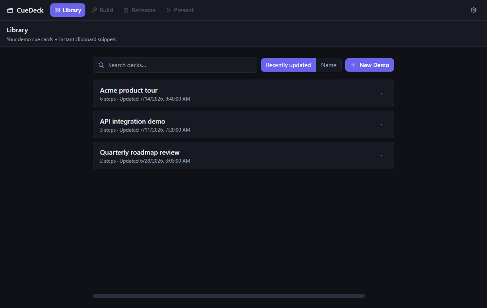
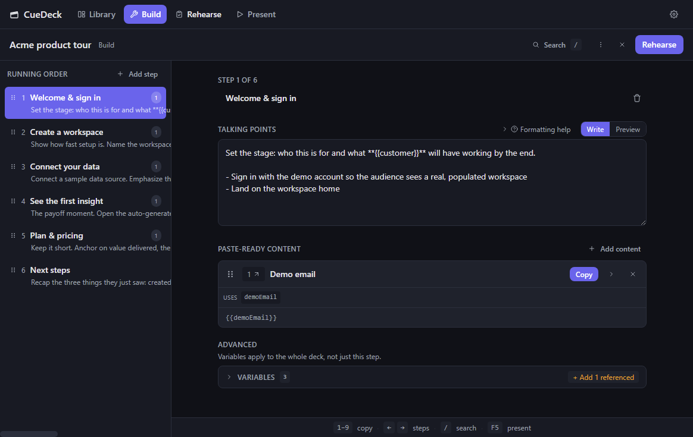
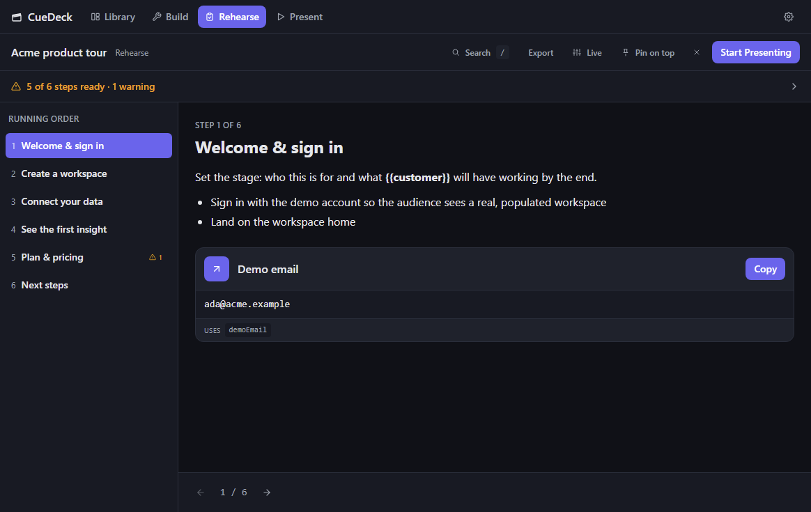
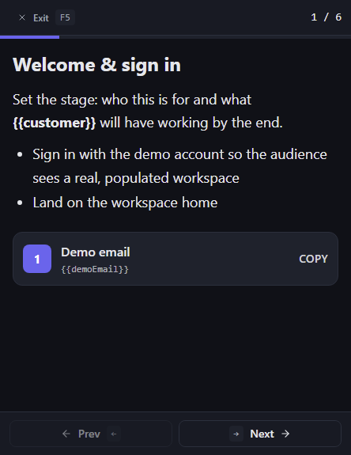

# 🎬 CueDeck

[](https://github.com/rwrife/cuedeck/actions/workflows/ci.yml)

**Demo cue cards with instant clipboard snippets.** A desktop teleprompter for software demos — lay out your talking points as cue cards, attach the text blobs you paste into the app you're demoing, and copy or drag them out in one click.

CueDeck is organized as a guided **Studio** with four modes — **Library**, **Build**, **Rehearse**, and **Present** — that walk you from "which demo?" all the way to delivering it from a compact, always-on-top surface.

Built with **Electron + React + TypeScript + Vite + Tailwind + Zustand**.

---

## The Studio workflow

CueDeck's persistent mode rail keeps the current step of your job — and the one clear next action — always in view.

### Library — _what am I working on?_

Find or start a demo. Search and sort your decks, or start a new one from a blank demo, a starter template, or an imported file.



### Build — _what will happen in my demo?_

Plan the running order and prepare content. Each **step** has **talking points** (safe-subset Markdown) and **paste-ready content** you copy live. Advanced tools — deck **variables**, formatting help, live control, and import/export — sit in a contextual Advanced area so they never crowd the primary flow. The one primary next action is **Rehearse**.



### Rehearse — _am I ready to present?_

A read-only, full-window run-through with a live **readiness** preflight. Warnings (empty titles, unfilled variables, low-content steps) link straight to the exact Build location that fixes them — they inform, they never block. The one primary next action is **Start Presenting**.



### Present — _what do I need right now?_

A compact, always-on-top surface with just the active step, rendered talking points, one-click paste actions, progress, and previous/next navigation. Exiting returns to Rehearse and restores your prior window size and always-on-top state.



---

## Why

If you give software demos, you probably script them: what to click, what to say, and the exact chunks of text you paste into forms mid-demo. Doing that in Notepad means constant alt-tabbing and hunting for the right blob. CueDeck gives that workflow real structure:

- **Steps** for each beat of the demo, in a stable **Build** running order.
- **Talking points** per step, written in a safe subset of **Markdown** (headings, bold/italic, inline code, bullet/ordered lists, and `- [ ]` task checkboxes) and rendered — sanitized — in Rehearse and Present.
- **Paste-ready content** — labeled text blobs with a big **Copy** button and a **drag handle** so you can drop them straight into the target app.
- **Rehearse** with a readiness preflight, then a **compact, always-on-top Present** surface that floats above your demo window.
- **Import / export** decks as `.json` files via native OS dialogs — back them up, commit them to a repo, or share with a teammate.

## Concepts

CueDeck's primary UI uses plain-language labels; the deck **file format** keeps its original terms. They map one-to-one:

| Studio label | File-format term | Meaning |
| --- | --- | --- |
| **Demo** / **Deck** | **Deck** | A full demo script. Saved as one `*.cuedeck.json` file. |
| **Step** | **Cue Card** | One step/beat. Has a title, talking points, and 0..N paste-ready snippets. |
| **Paste-ready content** | **Snippet** | A labeled blob of text. One-click copy + drag-out. |
| **Talking points** | **Notes** | Per-step notes in a safe subset of Markdown, rendered — sanitized — in Rehearse and Present. |
| **Variables** | **Variables** | Deck-level `{{placeholder}}` values substituted into paste-ready content on copy/drag. |

> **Deck file format:** decks are a single versioned JSON document
> (`*.cuedeck.json`). The format is documented in
> [`docs/deck-format.md`](docs/deck-format.md) with a published JSON Schema
> ([`schema/cuedeck.schema.json`](schema/cuedeck.schema.json), Draft 2020-12).
> Validation/normalization lives in one shared module
> ([`src/shared/deck.ts`](src/shared/deck.ts)) used by the app, CLI, and MCP
> server.

## Getting Started

```bash
npm install
npm run dev        # launch the app in dev mode (hot reload)
```

### Other scripts

```bash
npm run build      # type-check + build main/preload/renderer + the cuedeck CLI
npm run typecheck  # TS type-check (node + web)
npm run lint       # ESLint
npm run test       # Vitest unit tests
npm run build:cli  # build just the headless `cuedeck` CLI (out/cli/index.js)
npm run package    # build a distributable with electron-builder
```

### Headless CLI

CueDeck ships a **headless `cuedeck` CLI** so decks are fully scriptable from a
shell, CI, or an AI agent — no GUI required. It reads/writes the *same* on-disk
deck store as the app.

```bash
npm run build:cli
DECK=$(node ./out/cli/index.js create "Product Launch")
node ./out/cli/index.js add-card "$DECK" --title "Kickoff" --notes "Say hi"
node ./out/cli/index.js render "$DECK"
```

Every command (list, create, show, add-card, add-snippet, set-var, import,
export, validate, render), the `--dir` / `CUEDECK_DIR` override, `--json` output,
and exit codes are documented in **[`docs/cli.md`](docs/cli.md)**.

### MCP server — AI builds demos

CueDeck also ships a **`cuedeck-mcp`** [Model Context Protocol](https://modelcontextprotocol.io)
server so any MCP client (Claude Desktop, the Claude/OpenClaw CLI, …) can **build
and edit demos conversationally** and have them land directly in the same deck
store. Point a prompt at it — _"build me a 12-card demo of feature X"_ — and get
a real, openable deck, no manual data entry.

```bash
npm run build:mcp
CUEDECK_DIR=./my-decks node ./out/mcp/index.js   # stdio MCP server
```

The tools (`create_deck_from_outline`, `add_card`, `add_snippet`, `set_variable`,
`render_deck`, …), the readable `cuedeck://decks` / `cuedeck://deck/{id}`
resources, ready-to-paste client config snippets, and an example "build a demo"
prompt are documented in **[`docs/mcp.md`](docs/mcp.md)**.

### AI authoring — from a demo brief to a deck

Want an assistant to *build the demo for you*? Write a short **demo brief** (goal,
audience, key beats, the paste-blobs you need) and hand it — with a ready-made
prompt — to any `cuedeck-mcp` client. It turns the brief into a real deck in one
`create_deck_from_outline` call, which you then review and refine.

- **Guide:** **[`docs/ai-authoring.md`](docs/ai-authoring.md)** — the brief shape,
  how it maps to decks → cards → snippets → variables, and the conventions that
  make AI-authored demos good.
- **Templates:** [`templates/demo-brief.md`](templates/demo-brief.md) (fill it in)
  and [`templates/build-demo.prompt.md`](templates/build-demo.prompt.md) (hand it
  to the assistant).
- **Worked examples:** [`examples/`](examples/) — two full briefs (SaaS onboarding
  and an API/dev-tool demo) with the decks they produce, doubling as round-trip
  fixtures that lock the authoring contract in the test suite.


### Packaging / releases

CueDeck packages to native installers (Windows `.exe`/NSIS, macOS `.dmg`/`.zip`,
Linux `AppImage`/`.deb`) via **electron-builder**:

```bash
npm run package        # build the current OS's installers into release/
npm run package:linux  # AppImage + deb
npm run package:win    # NSIS installer
npm run package:mac    # dmg + zip (x64 + arm64)
```

See **[`RELEASING.md`](RELEASING.md)** for the full build/release process,
cross-OS caveats, icon replacement, and code-signing notes.

## Project Structure

```
src/
├── main/           # Electron main process
│   ├── index.ts        # window + core IPC (clipboard, always-on-top)
│   └── deckStore.ts    # deck persistence (JSON files in userData)
├── preload/        # contextBridge API (window.cuedeck.*)
│   └── index.ts
├── renderer/       # React app
│   ├── index.html
│   └── src/
│       ├── App.tsx
│       ├── main.tsx
│       ├── components/     # StudioShell + ModeRail, Library, DeckWorkspace (Build),
│       │                   #   RehearseView, PresenterView, and shared ui/ primitives
│       ├── store/          # Zustand store w/ debounced auto-save
│       └── styles/
├── shared/         # types + IPC channels + deck validator/normalizer (both sides)
└── cli/            # headless `cuedeck` CLI (deck store + commands, no Electron)
```

Authoring assets live at the repo root:

```
docs/ai-authoring.md   # demo-brief → deck guide
templates/             # demo-brief + build-demo prompt templates
examples/              # worked briefs + expected decks (round-trip fixtures)
```

## Data Storage

Decks are stored as individual JSON files under Electron's `userData` directory:

- **Windows:** `%APPDATA%/cuedeck/decks/`
- **macOS:** `~/Library/Application Support/cuedeck/decks/`
- **Linux:** `~/.config/cuedeck/decks/`

Each deck is human-readable JSON, so export/backup is just a file copy. You can also **Export** a deck — from its overflow menu in the **Library**, or from **Build**'s Advanced area — to save it anywhere via a native save dialog, and **Import…** (a New Demo choice in the Library) to load a deck file back in — imported decks are validated and assigned a fresh id so they never collide with existing ones.

## Roadmap

See the GitHub Issues for the build-out plan. Shipped so far: the guided
**Studio** (Library → Build → Rehearse → Present) with a readiness preflight and
safe save/undo, keyboard-driven copy hotkeys, drag-to-reorder, deck
import/export, search, a compact always-on-top Present surface, themes,
cross-platform packaging (see [`RELEASING.md`](RELEASING.md)), a headless
[`cuedeck` CLI](docs/cli.md) for scripting decks, a
[`cuedeck-mcp`](docs/mcp.md) server, and an
[AI-authoring workflow](docs/ai-authoring.md) (demo brief → deck).

## License

MIT © rwrife
